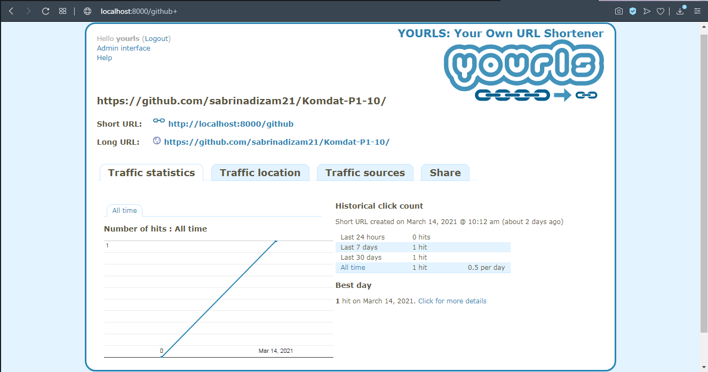
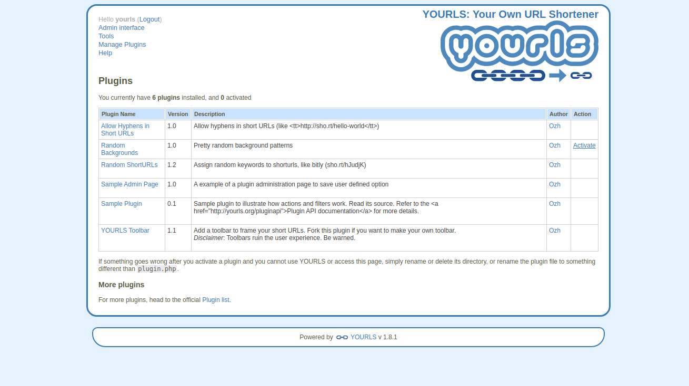
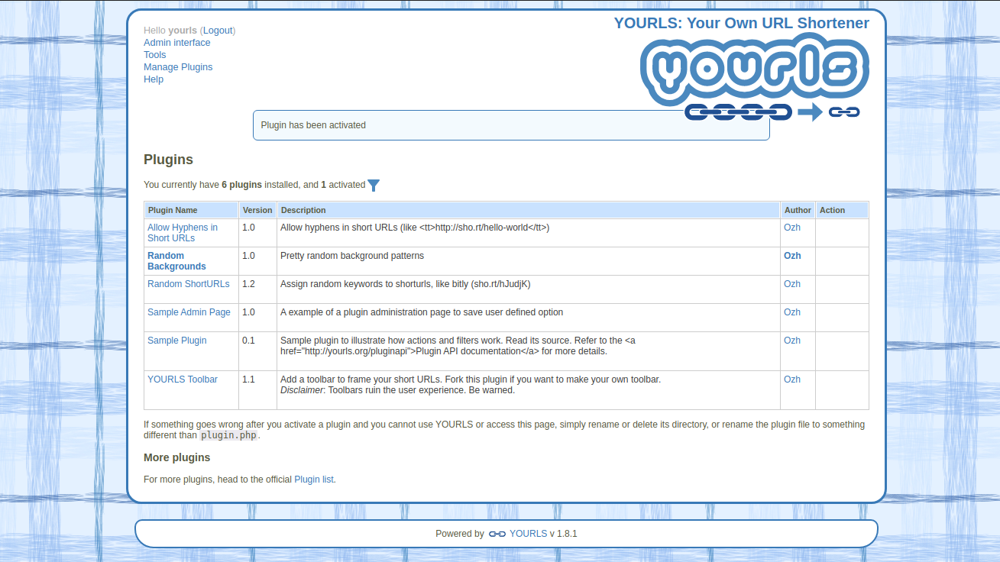
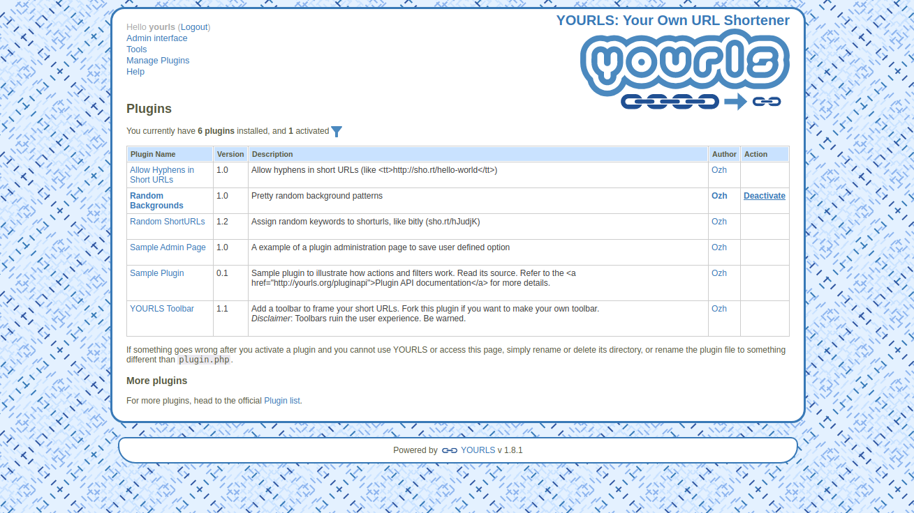
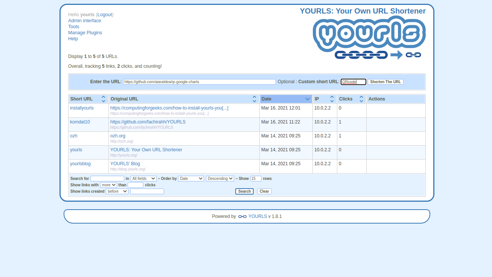

<h1 align="center"></h1>
<table align="center">
<thead>
<tr>
<th align="center"><a href="#sekilas-tentang">Sekilas Tentang</a></th>
<th align="center"><a href="#instalasi">Instalasi</a></th>
<th align="center"><a href="#cara-pemakaian">Cara Pemakaian</a></th>
<th align="center"><a href="#pembahasan">Pembahasan</a></th>
<th align="center"><a href="#referensi">Referensi</a></th>
</tr>
</thead>
</table align="center">

# YOURLS

## SEKILAS TENTANG
**YOURLS** (Your Own URL Shortener) adalah aplikasi dengan coding php script yang bisa digunakan untuk membuat website layanan URL shortening (memendekkan alamat suatu website, agar mudah dituliskan di posting forum, blog, email, dll). 

## INSTALASI
### Kebutuhan Sistem :
- Linux atau Windows.
- Nginx / Apache (httpd) version 2.4.
- PHP version 5.3.
- MySQL 5.0+.
- RAM minimal 64 Mb+
- PHP cURL extension

### Konfigurasi SSH :
- Login kedalam server menggunakan SSH. Untuk pengguna windows bisa menggunakan aplikasi [PuTTY](http://www.putty.org/).

  ```
    $ ssh student@localhost -p 2200
  ```
 
### Install semua kebutuhan yang diperlukan
- Sebelum menginstall kebutuhan yang diperlukan, pastikan seluruh paket pada sistem sudah up-to-date

  ```
    $ sudo apt update
  ```
 
- Install seluruh kebutuhan yang diperlukan

  ```
    $ sudo apt install mariadb-server
    $ sudo apt install php php-fpm php-cli php-mysql php-zip php-gd php-mbstring php-curl php-xml php-pear php-bcmath
    $ sudo apt install nginx
  ```
- Setelah semua kebutuhan telah diinstall, jalankan Nginx dan MariaDB

  ```
    $ sudo systemctl start nginx
    $ sudo systemctl start mariadb
  ```
  
### Membuat database untuk YOURLS
- Pertama masuk terlebih dahulu kedalam MariaDB

  ```
    $ sudo mysql
  ```
- Setelah masuk buat database bernama `yourls`

  ```
    CREATE DATABASE yourls;
  ```
- Berikan semua akses database `yourls` kepada user `yourls` dengan hostname `yourls@localhost` dan tambahkan password

  ```
    GRANT ALL PRIVILEGES ON yourls.* TO 'yourls'@'localhost' IDENTIFIED BY "YOUR-PASSWORD";
  ``` 
- Flush hak akses yang diberikan dan keluar dari `MariaDB`

  ```
    FLUSH PRIVILEGES;
    QUIT
  ```
 
### Download dan Install YOURSL
- Download YOURLS dari repositori Git dan tempatkan unduhan YOURLS ke direktori `/srv` 

  ```
    $ cd /srv
    $ sudo git clone https://github.com/YOURLS/YOURLS.git
  ```
- Masuk ke direktori `YOURLS/user`, lalu copy sample file konfigurasi YOURLS dan beri nama `config.php`

  ```
    $ cd YOURLS/user
    $ sudo cp config-sample.php config.php
  ```
- Edit file `config.php` sesuai dengan database yang telah dibuat pada MariaDB tadi 
  ```
    $ sudo config.php
  ```
- Set database connection 

  ```
    ** MySQL settings - You can get this info from your web host
    */
    
    /** MySQL database username */
    define( 'YOURLS_DB_USER', 'yourls' );
   
    /** MySQL database password */
    define( 'YOURLS_DB_PASS', 'YOUR-PASSWORD' );
   
    /** The name of the database for YOURLS */
    define( 'YOURLS_DB_NAME', 'yourls' );
   
    /** MySQL hostname.
    ** If using a non standard port, specify it like 'hostname:port', eg. 'localhost:9999' or '127.0.0.1:666' */
    define( 'YOURLS_DB_HOST', 'localhost' );
   
    /** MySQL tables prefix */                                                                                       
    define( 'YOURLS_DB_PREFIX', 'yourls_' ); 
  ```
- Set website URL untuk YOURLS

  ```
    /** YOURLS installation URL -- all lowercase, no trailing slash at the end.
    ** If you define it to "http://sho.rt", don't use "http://www.sho.rt" in your browser (and vice-versa) */
    define( 'YOURLS_SITE', 'http://localhost:8000' );
  ```
- Tambahkan Username(s) dan password(s) yang diizinkan untuk mengakses situs. Password dapat berupa teks biasa atau sebagai hash terenkripsi. YOURLS akan secara otomatis mengenkripsi sandi teks biasa dalam file ini
  
  ```
    /** Username(s) and password(s) allowed to access the site. Passwords either in plain text or as encrypted hashes
    ** YOURLS will auto encrypt plain text passwords in this file
    ** Read http://yourls.org/userpassword for more information */
    $yourls_user_passwords = array(
       'yourls' => 'YOUR-Password',
       'jmutai' => 'MyStrongPassword',
        // You can have one or more 'login'=>'password' lines
     );
  ```
- Ketika selesai, simpan dan keluar dengan cara `ctrl+o`, `enter` dan `ctrl+x`. Lalu ubah direktori kepemilikan `/srv/YOURLS` ke user www-data (web server) 
  
  ```
    $ sudo chown -R www-data:www-data /srv/YOURLS
  ```

### Download dan Konfigurasi Nginx
- Buat file konfigurasi baru pada direktori `/etc/nginx/conf.d/` dengan nama `yourls.conf`
  
  ```
    $ sudo nano /etc/nginx/conf.d/yourls.conf
  ```
- Sesuaikan direktori root dengan direktori tempat YOURLS didownload tadi
 
  ```
    server {
       listen 80;
       root /srv/YOURLS;
       index index.php index.html index.htm;
       listen [::]:80;
       location / {
         try_files $uri $uri/ /yourls-loader.php$is_args$args;
       }

       location ~ \.php$ {
         try_files $uri =404;
         fastcgi_split_path_info ^(.+\.php)(/.+)$;
         fastcgi_index index.php;
         fastcgi_param  SCRIPT_FILENAME  $document_root$fastcgi_script_name;
         fastcgi_pass unix:/var/run/php/php7.2-fpm.sock;
         include fastcgi_params;
       }
    }
  ```
- Setelah disimpan periksa syntax Nginx untuk memastikannya baik-baik saja (OK)
  
  ```
    $ sudo nginx -t
  ```
- Pastikan hasil yang keluar adalah ini, jika tidak coba periksa kembali file konfigurasi dari Nginx tadi

  ```
    nginx: the configuration file /etc/nginx/nginx.conf syntax is ok
    nginx: configuration file /etc/nginx/nginx.conf test is successful
  ```
- Restart Nginx service.

  ```
    $ sudo systemctl restart nginx
  ```
 
 ### Mengakses YOURLS
- Buka browser dan akses web instalasi YOURLS menggunakan URL yang telah diatur di `config.php` dan tambahkan `/admin`. Disini URL yang kami pakai berarti `http://localhost:8000/admin`. Selanjutnya kita akan diarahkan ke `http://localhost:8000/admin/install.php`

  

- Setelah mengklik install, page akan menuju tempat login

  

- Isi username dan password yang telah diatur di `config.php`. Lalu klik login

  

- YOURLS pun sudah siap digunakan

  

## CARA PEMAKAIAN
### Membuat Short Link
1. Untuk pemakaian YOURLS sendiri sama seperti aplikasi *short link* pada umumnya, yakni dengan memasukan URL yang ingin dipendekkan pada bagian **Enter the URL :**. Selajutnya, masukan inisial yang mengartikan URL sebelumnya pada bagian **Custom short URL** dimana pada bagian ini bersifat opsional. 

    
  
2. Ketika URL berhasil di-*short*, maka akan muncul *sweetalert success*.

    

3. Cara menggunakan short URL tersebut dengan memasukan `URL_YOURLS/inisial`. Karena URL yang kami gunakan adalah `http://localhost:8000`, maka dalam penggunaannya adalah `http://localhost:8000/inisial`.

    

4. Setelah itu, short URL tersebut akan mengarahkan ke halaman yang sesuai.

    
  
5. Jika URL yang ingin di-*short* sudah pernah digunakan sebelumnya, maka akan muncul *sweetalert failed*. Hal ini disebabkan URL yang sudah digunakan tidak bisa digunakan dua kali.
  
    
  
    
  
### Melihat Statistik
Pada web YOURLS, disediakan statistik short URL yang telah dbuat. Fitur statistik tersebut terletak pada kolom **Action** sesuai URL yang ingin dilihat statistiknya. Kemudian pilih *icon* yang ditandai.
    
  

Kemudian, akan ditampilkan statistik dari penggunaan short URL tersebut seperti gambar dibawah.
    
  
    
- Traffic Statistics : memperlihatkan histori dari jumlah *hits* pada short URL.    
- Traffic Location : menunjukkan histori jumlah klik short URL pada berdasarkan negara. Bagian ini akan diperlihatkan diagram Top 5 Countries dengan keterangan jumlah *hits* setiap negara.     
- Traffic Sources : menunjukkan diagram jumlah URL dibagikan beserta sumbernya. Kemudian, akan ditampilkan diagram perbandingan Direct vs Referrer Traffic.

### Fitur Search
YOURLS juga menyediakan fitur Search untuk mencari URL pada yang sudah pernah di-*short*. Hal ini bisa dilakukan dengan menulis kata kunci yang ingin dicari pada *search bar* dibawah tabel daftar URL. Lalu, tekan tombol **Search**.

  
  
Kemudian akan muncul daftar URL sesuai kata kunci seperti gambar dibawah ini.

  

### Manage Plugins
- #### Mengaktifkan dan Menonaktifkan Plugin
 
  Salah satu keuntungan YOURLS yaitu YOURLS menyediakan berbagai plugins yang mungkin saja berguna. Untuk mengatur plugins, klik `Manage Plugins` di sudut kiri atas. Secara default, YOURLS menyediakan 6 plugins

  
  
  Contohnya disini kita akan mengaktifkan plugin `Random Background`. Untuk mengaktifkan plugin, arahkan kursor ke tab `Action` dan klik `Activate`
  
  
  
  Setelah di klik akan muncul pemberitahuan plugin telah aktif. Selain itu juga terdapat informasi mengenai banyaknya plugin yang terinstall pada YOURLS dan berapa plugin yang aktif di atas tabel daftar plugin. Terlihat bahwa background pada page berubah
  
  
  
  Untuk menonaktifkan plugin arahkan lagi kursor ke tab `Action` dan klik `Deactivate`
  
  
 
- #### Menginstall Plugin
 
  YOURLS menyediakan banyak sekali plugins yang bisa diakses di [YOURLS Plugins](https://github.com/YOURLS/awesome-yourls#plugins-). Contohnya disini kita akan mengistall plugin [QR Google Charts](https://github.com/aiaraldea/qr-google-charts), yaitu plugin yang berfungsi untuk menampilkan QR code dari link yang akan disingkat.
  
  Caranya yaitu, buka terminal yang sudah login ke dalam server. Lalu masuk ke direktori `/YOURLS/user/plugins` 
  
  ```
    $ cd /srv/YOURLS/user/plugins
  ```
  
  Setelah itu download plugin melalui repositori Git yang sudah disediakan
  
  ```
    $ sudo git clone https://github.com/aiaraldea/qr-google-charts.git
  ```
  
  Refresh halaman `Manage Plugins`. Terlihat bahwa plugin berhasil ditambahkan. Klik `Activate` untuk mencoba plugin
  
  
  
  Masukkan link yang akan disingkat seperti biasa
  
  
  
  Terlihat bahwa link yang disingkat sekarang menyediakan QR code. Kekurangan plugin ini adalah, QR code tersebut tidak tersimpan pada database, sehingga hanya bisa dilihat sekali saja.
  
  

## PEMBAHASAN
YOURLS (Your Own URL Shortener) merupakan kumpulan kecil PHP scripts yang bisa menjalankan pemendekan URL milik sendiri. Dengan memanfaatkan layanan perangkat lunak ini, kita bisa memiliki data sendiri sehingga tidak perlu mengandalkan bantuan dari pihak ketiga seperti pada shortener url lain. Keuntungan lain adalah bisa membantu untuk branding brand produk milik sendiri ke dalam URL yang dibuat tersebut.
Fitur menarik yang menguntungkan dari YOURLS yaitu :
- Free and Open Sources
Fitur dan perangkat lunak shortener url ini tergolong sebagai perangkat lunak open source, dimana siapa saja bisa mendapatkannya dan yang paling penting adalah bisa didapatkan secara gratis.
- Menampilkan Data Statistik
Fitur selanjutnya yang menakjubkan dari YOURLS adalah adanya fitur statistik yang bisa menampilkan laporan histori klik dari pengunjung yang mengklik url tersebut, statistik rujukan pelacakan lain, serta statistil tentang geo-lokasi dari pengunjung yang mengakses url tersebut.
- Interface dan Plugin
Setiap pengguna internet pasti menginginkan agar tampilan antarmuka saat mengakses sebuah laman bisa lebih mudah. Karena itu shortener url ini menggunakan interface ajaxed yang rapi sehingga bisa lebih memudahkan pengguna. Selain itu, plugin yang digunakan juga sangat baik dalam mengimplementasikan setiap fitur-fitur baru yang ada di dalam url dengan lebih mudah. Ada juga sampel file yang bisa Anda gunakan untuk membuat antarmuka publik milik Anda sendiri.
- Mudah Digunakan
Dibandingkan dengan shortener url lainnya, perangkat lunak ini cenderung lebih mudah digunakan. Untuk mendapatkannya, Anda tinggal mengunduh di situs yourls.org, kemudian unduh script yang tersedia di dalamnya. Selanjutnya Anda tinggal upload script milik Anda di hosting Anda sendiri. Cara menginstalnya pun sudah disediakan di dalam file readme.html.

Disamping fiturnya yang menguntungkan, YOURLS juga memiliki kekurangan, antara lain :
- Banyak fungsi plugin harus dimasukkan ke dalam perangkat lunak secara default seperti pembuatan QR code. 
- UI admin terlihat agak ketinggalan jaman.
- Penginstalan memerlukan pengeditan file konfigurasi secara manual.

## REFERENSI
1. [About YOURLS](http://yourls.org) - YOURLS
2. [How to Install yourls on ubuntu 18.04](https://computingforgeeks.com/how-to-install-yourls-your-own-url-shortener-on-ubuntu-18-04-bionic-beaver-linux/)
3. [Web Shorten URL dengan YOURLS](https://www.krawu.com/membangun-situs-web-shorten-url-dengan-yourls-6637.html)
4. [How To Log Into a VPS with PuTTY (Windows Users)](https://www.digitalocean.com/community/tutorials/how-to-log-into-a-vps-with-putty-windows-users) - Digital Ocean


## UCAPAN TERIMA KASIH
Kami mengucapkan banyak-banyak terimakasih untuk teman-teman yang sudah meluangkkan waktu, tenaga, dan pikiran dalam pengerjaan projek ini, begitu juga teman-teman lainnya yang sudah ikut membantu dalam menyukseskan projek kami.. semoga selalu diberi keberkahan dan kemudahan.. <3

**Kelompok 10**
| Nama                           | NIM       |
| ------------------------------ | ----------|
| Fachirah Hestiana Rachmawati   | G64180021 |
| Sabrina Diza Melinda           | G64180029 |
| Zahra Aulia Firdausi           | G64180030 |
| Syukriyatul Hanifa             | G64180062 |
